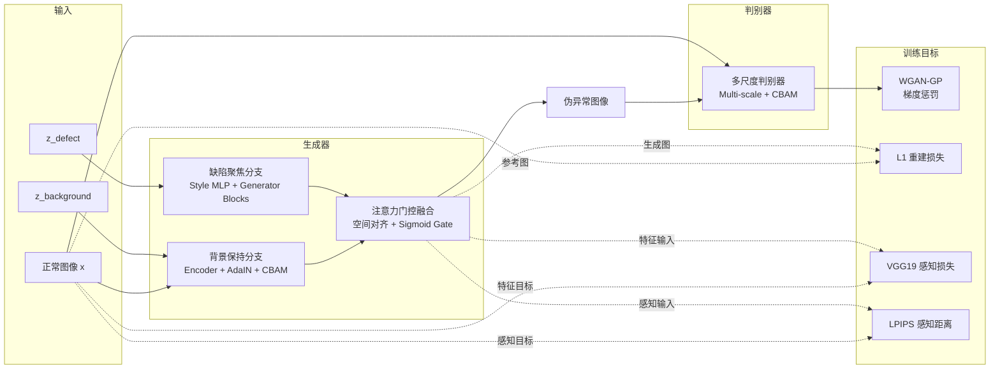

# Focus-StyleGAN 工业缺陷图像增广系统

[](https://github.com/MimiJimmy001/Industrial-Defect-Gan-Augmentation/actions/workflows/ci.yml)
[](https://www.python.org/)
[](https://pytorch.org/)
[](LICENSE)

面向 MVTec AD 工业质检场景的双分支缺陷图像增广系统。项目将“缺陷区域生成”和“背景结构保持”解耦，通过 AdaIN、CBAM 和注意力门控融合生成伪异常样本，并提供 GAN、真实缺陷迁移、检索式和缺陷堆叠四类增广管线。



<details>
<summary><strong>English Overview</strong></summary>

Focus-StyleGAN is a dual-branch industrial defect augmentation system for MVTec AD. It decouples defect synthesis from background preservation, fuses both branches with attention gating, and supports four augmentation pipelines. The repository provides model, training, evaluation, CLI and web-demo code, but does not ship datasets, trained checkpoints or verified benchmark results.

</details>

## 项目定位

这个项目不以“调用预训练模型做一次推理”为目标，而是完整实现一套工业缺陷样本增广流程：

- 用缺陷聚焦分支生成局部异常表示。
- 用背景保持分支约束正常结构不被破坏。
- 用注意力门控融合两个分支。
- 用多尺度判别器和 WGAN-GP 提升训练稳定性。
- 用生成质量、图像保真、物理合理性和异常检测指标共同评估效果。
- 用 CLI 和 Web 演示验证四类增广管线可以实际调用。

项目源于毕业设计，当前版本按工程项目标准重新整理。所有未完成的训练结果和指标均明确标记为“待运行”，不将“实现评估代码”描述成“已经取得实验结果”。

## 核心能力

- **Focus-StyleGAN**：缺陷聚焦分支、背景保持分支、AdaIN 风格控制、CBAM 注意力和注意力门控融合。
- **WGAN-GP 训练器**：梯度惩罚、n_critic 更新节奏、AMP、在线 FID、最佳模型保存和 Optuna 接口。
- **四类增广管线**：GAN 伪异常、真实缺陷迁移、检索式增广、缺陷堆叠增广。
- **多维评估代码**：FID、IS、LPIPS、PSNR、SSIM、PPS、Pixel-AUC、Region-AUC、PRO-AUC 和消融框架。
- **交互演示**：Flask 页面与 REST API 支持图片上传、生成、对比和下载。
- **可复现配置**：数据、模型、训练、评估和增广参数集中在 `core/integrated_config.yaml`。

## 项目内容导航

| 文档 | 内容 |
|---|---|
| [项目案例研究](docs/CASE_STUDY.md) | 业务问题、数据流、四类增广、工程取舍、失败模式和后续路线 |
| [模型设计](docs/MODEL_DESIGN.md) | 双分支结构、AdaIN、CBAM、融合模块、损失函数和训练顺序 |
| [评估协议](docs/EVALUATION_PROTOCOL.md) | 指标定义、公式、实验矩阵、消融设计、待运行结果模板 |
| [面试指南](docs/INTERVIEW_GUIDE.md) | 60 秒/3 分钟/10 分钟讲述、常见追问、代码阅读路径和简历表述 |
| [核心配置](core/integrated_config.yaml) | 训练、模型、评估和增广参数 |

## 真实验证状态

| 项目 | 状态 | 说明 |
|---|---|---|
| 双分支模型与前向逻辑 | 已实现 | `model/models/focus_stylegan.py` |
| WGAN-GP、AMP、在线 FID | 已实现 | `model/training/trainer.py` |
| 四类增广管线 | 已实现 | `core/integrated_augmentor.py` 与相关核心模块 |
| 评估指标与消融框架 | 已实现 | `model/evaluation/` |
| Flask Web 演示 | 已实现 | `web/app.py`、`web/web_api.py` |
| GitHub Actions | 已配置 | 当前执行语法与关键静态检查，不运行 GAN 训练 |
| MVTec AD 数据集 | 未包含 | 需要按官方说明下载到 `datasets/mvtec_anomaly_detection/` |
| 训练权重与 checkpoint | 未包含 | 需要自行训练或放置兼容权重 |
| 完整训练与调参 | 待运行 | 需要 GPU、数据集和足够的训练时间 |
| FID/AUC/提升率等结果 | 待运行 | 当前没有可复现的完整实验指标，不提供虚构数值 |

> 旧 checkpoint 与 2026-08 之后的模型结构不一定兼容，正式实验应重新训练。完整测试依赖 PyTorch 和 MVTec AD，本地缺少依赖时不能声称全量测试已通过。

## 环境安装

推荐使用 Python 3.10/3.11 和独立虚拟环境：

```bash
python -m venv .venv
# Windows
.venv\Scripts\activate
# Linux / macOS
source .venv/bin/activate

python setup_env.py
```

也可以先按显卡环境安装 PyTorch，再安装其余依赖：

```bash
# CUDA 12.1 示例
pip install torch torchvision torchaudio --index-url https://download.pytorch.org/whl/cu121
# CPU 示例
pip install torch torchvision torchaudio --index-url https://download.pytorch.org/whl/cpu

pip install -r requirements.txt
```

VGG/Inception/ResNet 预训练权重可放入 `weights/`，否则部分评估模块会在首次运行时尝试下载。

## 快速开始

### 1. 最小运行与配置检查

```bash
python -m compileall -q .
python core/integrated_augmentor.py --mode info
```

`--mode info` 用于确认配置和运行时环境可加载，不需要 MVTec AD 和已训练权重。

### 2. 准备 MVTec AD

从 MVTec 官方页面下载数据集并整理为：

```text
datasets/
└── mvtec_anomaly_detection/
    ├── bottle/
    ├── carpet/
    ├── hazelnut/
    └── ...
```

数据集、checkpoint、weights 和输出目录均已加入 `.gitignore`，不要提交大文件。

### 3. GPU 完整训练

```bash
python -c "import logging, torch; from model.training.trainer import create_trainer_from_config; device=torch.device('cuda' if torch.cuda.is_available() else 'cpu'); trainer=create_trainer_from_config('core/integrated_config.yaml', device, logging.getLogger('train')); trainer.train()"
```

默认配置为 256×256、batch size 32、100 epochs、`n_critic=5`、`lambda_gp=10`、AMP 和 `seed=42`。显存不足时可降低 batch size，但不能在正式实验中静默改变其他指标口径。

### 4. 四类增广

```bash
# GAN 伪异常
python core/integrated_augmentor.py --mode single --input path/to/good.png --variations 5

# 真实缺陷迁移
python core/integrated_augmentor.py --mode real --input path/to/good.png --category bottle

# 检索式增广
python core/integrated_augmentor.py --mode retrieval --input path/to/good.png --category bottle

# 缺陷堆叠
python core/integrated_augmentor.py --mode stacking --input path/to/good.png --category bottle
```

GAN 模式需要匹配当前模型结构的 checkpoint；真实缺陷迁移、检索和堆叠模式可根据各自模块的输入要求运行。

### 5. 评估

仓库已经提供 `Evaluator` 和 `AnomalyDetectionEvaluator`，但没有单独的 `evaluate.py` 一键入口。正式评估前先阅读 [评估协议](docs/EVALUATION_PROTOCOL.md)，按固定数据划分、样本量、随机种子和基线配置执行：

- `model/evaluation/evaluator.py`：FID、IS、LPIPS、PSNR、SSIM、PPS。
- `model/evaluation/anomaly_detection_evaluator.py`：Pixel-AUC、Region-AUC、PRO-AUC 和增广前后增益。
- `model/evaluation/ablation.py`：损失、分支、注意力和判别器尺度消融。

评测结果必须同时记录样本量、数据划分、checkpoint、预处理和运行环境；没有这些信息的结果不能横向比较。

### 6. Web 演示

```bash
pip install -r web/requirements-web.txt
python web/app.py
```

REST API 入口见 `web/web_api.py`。Web 演示同样是代码能力展示，不代表已完成真实产线部署或生产级推理服务。

## 项目结构

```text
core/                       增广管线、缺陷注册表、融合与 Web CLI
model/models/               双分支 Focus-StyleGAN、AdaIN、CBAM、判别器
model/training/             WGAN-GP、AMP、FID、Optuna 和 checkpoint
model/evaluation/           指标、异常检测评估、PPS、消融与可视化
model/augmentation/         GAN 增广、检索和堆叠逻辑
web/                        Flask 页面与 REST API
tests/                      模型形状、模块导入、PPS、PRO-AUC 等测试
docs/                       案例、模型设计、评估协议和面试指南
```

## 当前边界

- 没有数据集、训练权重和完整训练日志，因此当前仓库不提供 FID、AUC 或提升率结论。
- MVTec AD 是公开数据集，但完整跨类别训练成本较高，当前配置面向单机 GPU；显存和环境差异会影响结果。
- IS 基于 ImageNet 分类模型，对工业缺陷局部异常的解释力有限，不能单独作为质量结论。
- PPS 是本项目自定义的物理合理性指标，尚未完成与人工专家判断或下游任务增益的系统验证。
- 当前 CI 只做语法和关键静态检查，不替代模型训练测试、GPU 显存测试和端到端实验。
- 旧 checkpoint 与当前模型结构可能不兼容，加载时应根据权重警告重新训练。

## License

本项目使用 MIT License，详见 [LICENSE](LICENSE)。