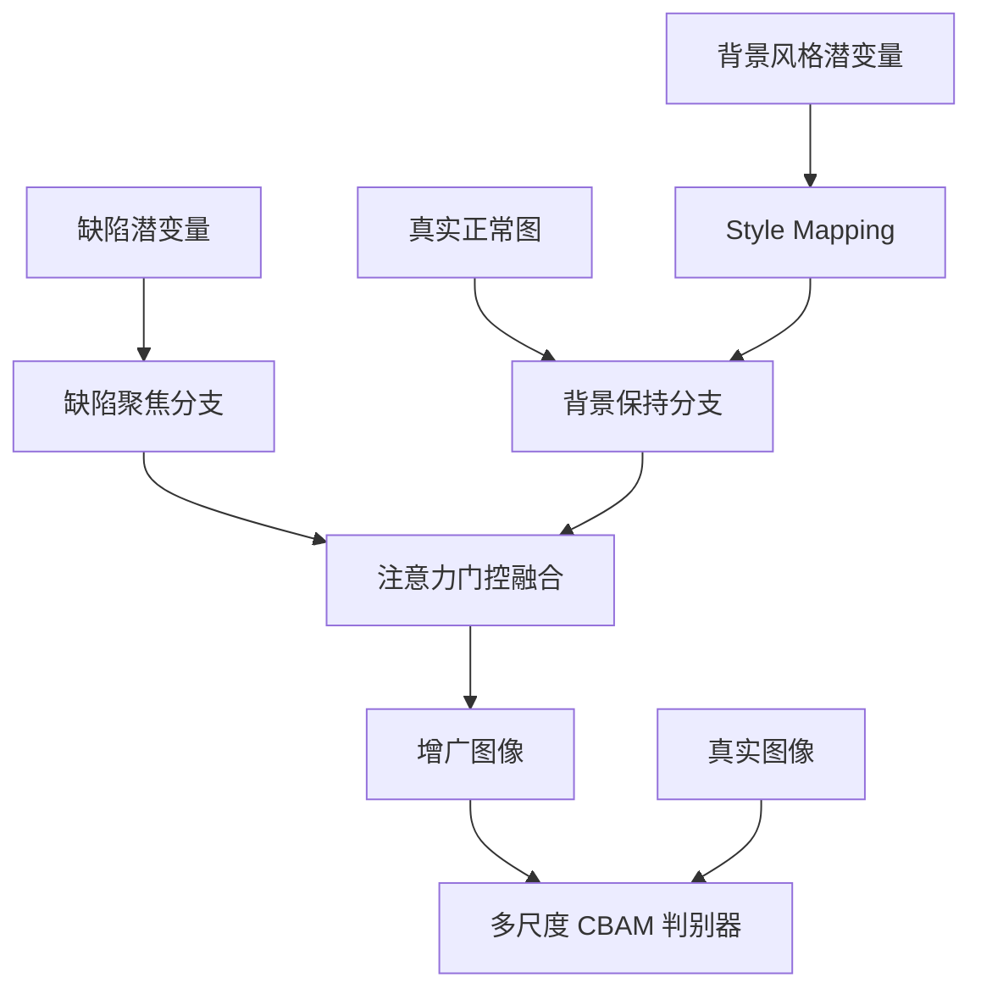

# 项目案例研究：Focus-StyleGAN 工业缺陷图像增广

## 一、项目背景

工业质检数据集常见的问题是缺陷样本数量少、缺陷类型分布不均、真实产线缺陷形态差异大，而且缺陷区域通常只占整张图像的一小部分。直接使用传统几何变换增广，很容易破坏缺陷的局部结构，或者让背景和缺陷在语义上不匹配。

本项目的目标不是简单生成“看起来像缺陷”的图片，而是把缺陷生成拆成两个可控制分支：一个负责缺陷区域，一个负责背景保持，再通过融合模块合成最终样本，并使用多类指标评估生成质量、保真度和异常检测增益。

## 二、模型架构



核心组件：

- `StyleMappingNetwork`：将潜变量映射为多层风格向量。
- `DefectFocusedBranch`：生成缺陷区域特征，默认输出 256×256 表示。
- `BackgroundPreservingBranch`：在保持原图结构的基础上引入风格控制。
- `FusionModule`：通过注意力门控融合缺陷和背景分支。
- `MultiScaleDiscriminator + CBAM`：在多个尺度判断图像真实性，并强化通道与空间注意力。
- WGAN-GP：使用梯度惩罚提升训练稳定性。

## 三、四类增广管线

| 管线 | 核心思路 | 适用场景 |
|---|---|---|
| GAN 伪异常生成 | 通过缺陷类型注册表调制潜向量 | 缺陷样本极少，需要快速扩充 |
| 真实缺陷迁移 | 将真实缺陷区域融合到新背景 | 希望保留真实缺陷纹理 |
| 检索式增广 | 检索相似缺陷后迁移 | 缺陷类别内部差异较小 |
| 缺陷堆叠增广 | 在同一图像中组合多个缺陷 | 模拟复合缺陷或复杂表面 |

这四类管线共用底层图像特征、融合和缺陷注册逻辑，避免每种方法各写一套不兼容流程。

## 四、评估体系

项目实现并覆盖了以下指标或框架：

- 生成质量：FID、IS。
- 图像保真：LPIPS、PSNR、SSIM。
- 领域合理性：PPS（用于衡量缺陷位置、形态与背景的物理合理性）。
- 异常检测：Pixel-AUC、PRO-AUC。
- 实验方法：消融实验、Optuna 超参搜索、可视化输出。

`tests/` 中包含模型形状、模块导入、PPS、可视化、CBAM、消融配置和 PRO-AUC 等测试。由于完整训练需要 MVTec AD 数据集、PyTorch 和 GPU 环境，仓库不包含实际训练权重和大规模实验 CSV。

> 本项目不把“实现了评估代码”写成“已经得到某个 FID 或 AUC 数字”。真实训练结果需要在明确数据划分、训练轮数和硬件环境后重新生成，并保存对应的实验记录。

## 五、工程化设计

- 统一配置：`core/integrated_config.yaml` 控制数据、模型、训练、评估和增广参数。
- 固定随机种子：默认 `seed=42`，覆盖数据划分、潜变量和增广流程。
- 混合精度：CUDA 可用时启用 AMP。
- 在线 FID：每 10 个 epoch 评估一次，辅助选择最佳模型。
- 权重兼容提示：当新旧 checkpoint 结构不一致时给出缺失/多余权重警告。
- Web 演示：Flask API 和前端页面覆盖图片上传、生成、对比和下载。
- 可选超分：Real-ESRGAN 作为独立后处理模块，不强制依赖。

## 六、复现流程

```bash
python setup_env.py
pip install -r requirements.txt

# 将 MVTec AD 数据集放到 datasets/mvtec_anomaly_detection/
python -c "import torch; from model.training.trainer import create_trainer_from_config; import logging; trainer=create_trainer_from_config('core/integrated_config.yaml', torch.device('cuda' if torch.cuda.is_available() else 'cpu'), logging.getLogger('train')); trainer.train()"
```

单独执行所有四类增广：

```bash
python core/integrated_augmentor.py --mode single --input path/to/good.png --variations 5
python core/integrated_augmentor.py --mode real --input path/to/good.png --category bottle
python core/integrated_augmentor.py --mode retrieval --input path/to/good.png --category bottle
python core/integrated_augmentor.py --mode stacking --input path/to/good.png --category bottle
```

## 七、当前边界

- 实际生成质量依赖训练数据、权重、GPU 和轮数，仓库中的代码与配置不能替代完整实验记录。
- MVTec AD 数据集和预训练权重未随仓库分发，需要按说明下载。
- 旧 checkpoint 与 2026-08 后的模型结构不完全兼容，正式实验需要重新训练。
- 当前 CI 做的是语法与关键静态检查，不运行完整 GAN 训练。
- IQA/FID 类指标需要与固定样本量、预处理和随机种子一起报告，避免不同实验之间不可比较。

## 八、面试讲解框架

### 为什么要分成缺陷分支和背景分支？

如果用一个生成器同时负责缺陷纹理和背景，模型容易为了降低损失而改变整张图像，导致背景漂移。双分支把“生成缺陷”和“保持背景”显式解耦，再通过融合模块学习两者权重。

### 如何防止生成结果只追求视觉相似？

除了 FID 和 IS，还加入 LPIPS、PSNR、SSIM、PPS 以及 Pixel-AUC/PRO-AUC。它们分别衡量分布相似性、像素保真度和下游异常检测收益，避免单指标导向。

### 如何保证实验可复现？

固定全局种子，数据和模型参数集中在 YAML 中；训练、评估和增广都读取同一配置。正式实验还必须在报告中记录数据划分、样本量、训练轮数和硬件信息。

## 九、简历可复用表述

- 设计基于双分支生成器和注意力门控融合的 Focus-StyleGAN，实现缺陷区域生成与背景结构保持解耦。
- 实现 GAN 伪异常、真实缺陷迁移、检索式增广和缺陷堆叠四类增广管线，覆盖不同缺陷样本规模与形态场景。
- 构建 FID、IS、LPIPS、PSNR、SSIM、PPS、Pixel-AUC、PRO-AUC 和消融实验评估框架，支持从生成质量和异常检测效果两个层面验证增广。
- 使用多尺度 CBAM 判别器与 WGAN-GP 提升训练稳定性，并提供 Flask Web 演示和统一配置入口。

## 十、后续演进

1. 补充完整训练日志、固定测试集和可复现实验报告。
2. 对四类增广管线做统一消融，比较缺陷生成质量与下游检测增益。
3. 增加小样本、跨类别和跨域迁移实验。
4. 将 Web 演示补充真实推理耗时、显存占用和失败案例分析。