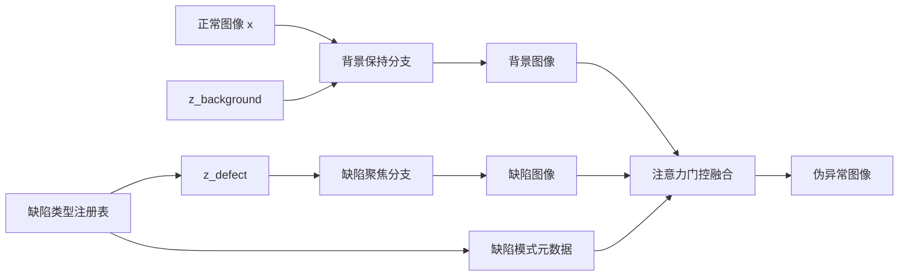
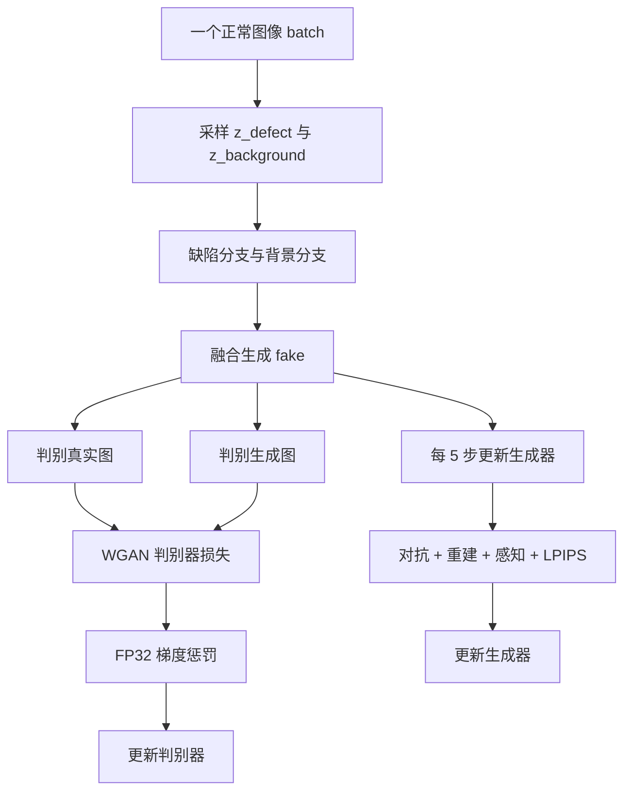
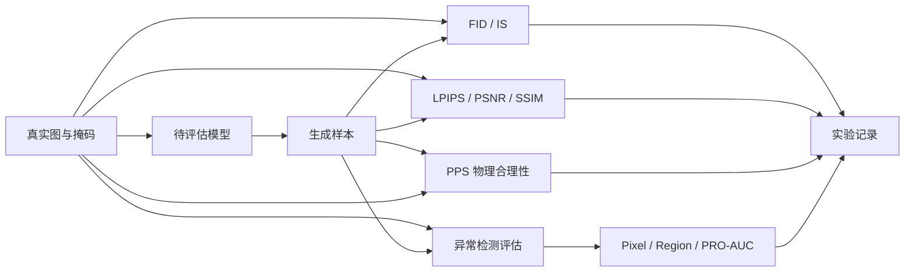

# Focus-StyleGAN 工业缺陷图像增广：项目案例研究

## 1. 一分钟定位

工业质检中真正稀缺的往往不是正常图像，而是类型丰富、位置多样、边界清晰的缺陷图像。传统几何增广可以增加样本数量，却容易改变缺陷形状、破坏背景结构，甚至制造不符合材料规律的纹理。

Focus-StyleGAN 将这个矛盾拆成两个独立目标：缺陷聚焦分支负责生成异常区域，背景保持分支负责保留正常结构，融合模块再学习两者应该以什么比例合并。项目进一步提供 WGAN-GP 训练器、四类增广管线、异常检测评估和 Web 演示。

这个案例研究面向面试讲解，重点回答三个问题：为什么这样设计、代码如何实现、哪些结论已经验证、哪些仍待实验。

## 2. 业务问题与成功标准

### 需要解决的问题

- 缺陷样本少且类别不均衡，异常检测模型难以学习稳定的局部特征。
- 单一生成器容易为了降低重建损失而改变整张图，导致背景漂移。
- 简单复制粘贴缺陷会破坏边缘、纹理和光照连续性。
- 只看 FID 或 IS 无法说明增广是否真正提升异常检测效果。

### 成功标准

| 维度 | 目标 | 对应实现 |
|---|---|---|
| 缺陷可控性 | 不同缺陷类型可以调制生成模式 | `core/defect_registry.py` |
| 背景保持 | 生成过程不破坏主体结构 | `BackgroundPreservingBranch` |
| 融合质量 | 缺陷和背景边界自然过渡 | `FusionModule` |
| 训练稳定性 | 降低梯度震荡和模式崩溃风险 | WGAN-GP、多尺度判别器 |
| 可评估性 | 同时观察生成质量、保真度和检测增益 | `model/evaluation/` |
| 可复现性 | 数据、模型和增广参数统一管理 | `core/integrated_config.yaml` |

## 3. 数据流

数据记录的文本标签、真实缺陷图片和生成样本共同构成后续评估输入；当前仓库不包含 MVTec AD 原始图片、掩码和训练权重，运行完整流程前需要自行准备。

## 4. 为什么采用双分支结构

### 单分支方案的风险

如果同一个生成器同时学习缺陷纹理和背景结构，损失函数会鼓励它在整张图上做最小误差调整。结果是缺陷区域虽然出现，但背景细节、亮度和边缘也可能一起变化。对于工业质检，这种“全局漂移”会让异常检测器把背景变化误判为缺陷。

### 双分支方案

| 分支 | 输入 | 输出 | 职责 |
|---|---|---|---|
| 缺陷聚焦分支 | `z_defect` | 缺陷图像/特征 | 生成局部异常纹理和形状 |
| 背景保持分支 | 正常图像 `x`、`z_background` | 背景图像/特征 | 保留物体结构、边缘和整体光照 |
| 融合模块 | 两个分支输出 | 伪异常图像 | 通过空间对齐、注意力门控和融合卷积组合两者 |

双分支不是简单地“两个网络取平均”，而是让两个分支承担不同损失职责：缺陷分支负责异常多样性，背景分支负责结构一致性，融合模块负责局部边界和全局一致性之间的权衡。

## 5. 模型组成

### AdaIN 风格控制

`AdaIN` 将内容特征的通道均值和方差替换为风格向量对应的统计量。它让同一背景结构可以接受不同缺陷风格，而不需要为每种缺陷单独训练生成器。

### CBAM 注意力

`CBAM` 同时执行通道注意力和空间注意力，使生成器和判别器更关注缺陷纹理、边缘和局部反差，而不是被大面积正常背景稀释。

### 注意力门控融合

`FusionModule` 先对齐缺陷和背景特征，再学习空间门控权重。直觉上，缺陷区域门控值应更接近缺陷分支，背景区域应更接近背景分支，边界附近则由网络学习过渡。

### 多尺度判别器

`MultiScaleDiscriminator` 在多个尺度聚合判别结果，并可在每个尺度使用 CBAM。较小尺度关注纹理真实感，较大尺度关注整体结构和缺陷区域是否合理。

## 6. 四类增广管线

| 管线 | 数据依赖 | 是否依赖 GAN 权重 | 适合情况 | 主要风险 |
|---|---|---|---|---|
| GAN 伪异常 | 正常图 + 缺陷类型注册表 | 是 | 缺陷样本极少，需要快速扩充 | 生成纹理可能失真 |
| 真实缺陷迁移 | 正常图和真实缺陷图 | 否 | 保留真实缺陷纹理和边界 | 粘贴位置和尺度不自然 |
| 检索式增广 | 缺陷样本库 | 否 | 需要相似形态缺陷 | 检索偏差导致模式重复 |
| 缺陷堆叠 | 多个缺陷实例 | 否 | 模拟复合缺陷 | 缺陷重叠不符合物理规律 |

四类管线共享特征、混合和缺陷注册逻辑。面试时可以把它们解释为“不同数据条件下可切换的增广策略”，而不是四个互不相关的脚本。

## 7. 训练流

当前配置中的关键参数：

| 参数 | 值 | 作用 |
|---|---:|---|
| 图像尺寸 | 256×256 | 兼顾局部缺陷细节与显存 |
| batch size | 32 | 面向主流 GPU 的默认配置 |
| epochs | 100 | 完整训练轮数 |
| `n_critic` | 5 | 每 5 次判别器更新执行 1 次生成器更新 |
| `lambda_gp` | 10 | WGAN-GP 梯度惩罚权重 |
| `lambda_reconstruction` | 10 | 重建损失权重 |
| `lambda_perceptual` | 0.1 | 感知损失权重 |
| `lambda_lpips` | 1.0 | LPIPS 权重 |
| FID interval | 10 | 每隔 10 个 epoch 评估一次 |
| FID samples | 1000 | 训练中 FID 的样本量 |
| seed | 42 | 数据划分、潜变量和增广随机性 |

## 8. 评估流

评估协议必须固定数据划分、样本量、图像预处理、checkpoint 和随机种子。FID 和 IS 反映分布层面的生成质量；LPIPS、PSNR 和 SSIM 反映与真实图像的接近程度；Pixel-AUC、Region-AUC 和 PRO-AUC 则回答增广是否真正帮助异常检测。

## 9. 关键工程取舍

### 为什么用 WGAN-GP

普通 GAN 的判别器容易出现梯度消失或训练震荡。WGAN-GP 使用 Wasserstein 距离和梯度惩罚约束判别器，更适合这种缺陷局部差异明显、训练样本量有限的任务。

### 为什么梯度惩罚用 FP32

训练主体可以使用 AMP 降低显存，但梯度范数计算对数值精度更敏感。当前代码把梯度惩罚放到 FP32 计算，避免 AMP 下的尺度偏差影响惩罚项。

### 为什么判别器不使用 BatchNorm/InstanceNorm

WGAN-GP 的判别器约束依赖单个样本的梯度行为，批归一化会让样本之间产生依赖。代码主动避免在判别器中使用这类范数层，改为其他稳定化结构。

### 为什么保留四类增广

GAN 权重和训练质量不可控时，真实缺陷迁移、检索和堆叠仍然可以工作。四类管线形成了从“完全生成”到“真实素材组合”的连续备选方案。

### 为什么评估多层指标

单个 FID 低不代表缺陷位置合理，单个 Pixel-AUC 高也不代表生成图像自然。生成质量、保真度和下游检测效果必须分别报告。

## 10. 常见失败模式

| 现象 | 可能原因 | 优先排查 | 可调参数 |
|---|---|---|---|
| 背景整体漂移 | 重建/感知损失过弱或融合偏向缺陷分支 | 对比背景分支输出和融合输出 | `lambda_reconstruction`、`lambda_perceptual` |
| 缺陷过强 | 缺陷风格调制过强 | 检查注册表中的调制参数 | `intensity`、缺陷注册表 |
| 缺陷不明显 | 融合门控过度偏向背景 | 检查门控图和融合权重 | 融合模块、缺陷损失权重 |
| 模式崩溃 | 判别器过强或生成器先验单一 | 观察生成样本多样性 | `n_critic`、学习率、噪声维度 |
| 梯度爆炸 | 梯度惩罚、学习率或 AMP 数值问题 | 检查 loss、梯度范数和 scaler | `lambda_gp`、lr、AMP、梯度裁剪 |
| 显存不足 | 256×256、batch 32、多尺度判别器 | 查看 GPU 峰值显存 | batch size、图像尺寸、n_scales |
| 旧权重加载失败 | 模型结构已变更 | 阅读缺失/多余权重警告 | 重新训练或迁移权重 |

## 11. 真实验证状态

### 已实现能力

| 能力 | 代码位置 | 状态 |
|---|---|---|
| 双分支生成器、AdaIN、CBAM、融合模块 | `model/models/focus_stylegan.py` | 已实现 |
| WGAN-GP、AMP、FID、Optuna 入口 | `model/training/trainer.py` | 已实现 |
| 四类增广管线 | `core/integrated_augmentor.py` 等 | 已实现 |
| 生成质量与异常检测评估代码 | `model/evaluation/` | 已实现 |
| Web 页面与 REST API | `web/` | 已实现 |
| 语法与关键静态检查 | `.github/workflows/ci.yml` | 已配置 |

### 已运行验证

当前可确认的验证是代码层面的结构检查、模块导入、部分指标计算测试和 Syntax CI。由于本地环境没有 PyTorch、MVTec AD 和训练权重，仓库当前不能声称以下内容已经完成：

- 100 epochs 完整训练。
- 单类别或全类别 FID、IS、LPIPS 指标。
- 扩大增广数据后异常检测模型的真实提升率。
- 多类别跨域泛化和稳定性结论。

### 待补实验

| 实验 | 当前状态 | 验收条件 |
|---|---|---|
| 单类别训练基线 | 待运行 | 固定 seed、记录 loss/FID 曲线、保存 checkpoint |
| 四类增广对比 | 待运行 | 相同数据划分、相同检测器、报告均值与方差 |
| 消融实验 | 待运行 | 无 CBAM/AdaIN/单分支/单尺度等配置可单独复现 |
| 跨类别泛化 | 待运行 | 明确训练类别与测试类别，不混用测试数据 |
| 显存与推理速度 | 待运行 | 记录 GPU 型号、batch size、峰值显存和耗时 |

## 12. 当前边界与后续路线

- 数据集、权重和完整实验日志未纳入仓库，不能把代码存在等同于实验结论。
- PPS 是自定义指标，需要与人工判断或异常检测增益建立相关性后再作为强证据。
- IS 依赖 ImageNet 分类分布，对工业缺陷这种局部分布的解释能力有限。
- 当前 Syntax CI 不运行 PyTorch 测试和 GAN 训练，真实训练需要独立 GPU 流程。
- 旧 checkpoint 与当前结构可能不兼容，升级模型后应重新训练。

后续路线按以下顺序推进：

1. 在一个 MVTec AD 类别上完成固定种子训练，保存曲线、样本网格和实验配置。
2. 用同一检测器和固定数据划分比较原始、传统增广、四类增广与消融配置。
3. 补充显存、耗时和失败样本分析，形成可复现 experiment record。
4. 扩展到多个类别，分析跨类别泛化和不同缺陷模式的稳定性。

## 13. 面试中的三分钟讲述

先用一句话说明问题：工业缺陷样本少，直接生成或复制缺陷容易破坏背景和物理连续性。然后说明设计：缺陷分支负责异常表示，背景分支负责结构保持，融合模块学习局部边界。接着讲训练：WGAN-GP、多尺度 CBAM 判别器、n_critic=5 和 FP32 梯度惩罚。最后讲验证边界：代码已经覆盖生成、四类增广和评估，但真实 FID/AUC 尚未运行，因此不会把未验证指标写进简历。

更完整的面试问答和代码阅读路径见 [INTERVIEW_GUIDE.md](INTERVIEW_GUIDE.md)，损失函数和分支结构见 [MODEL_DESIGN.md](MODEL_DESIGN.md)，实验矩阵见 [EVALUATION_PROTOCOL.md](EVALUATION_PROTOCOL.md)。