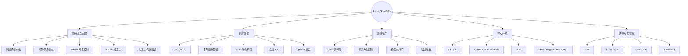
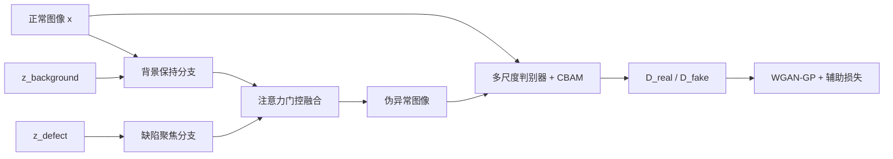
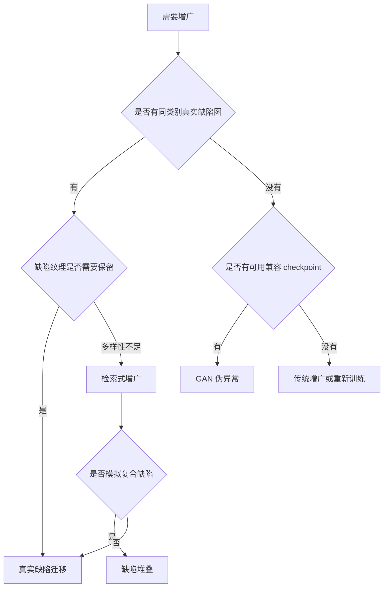
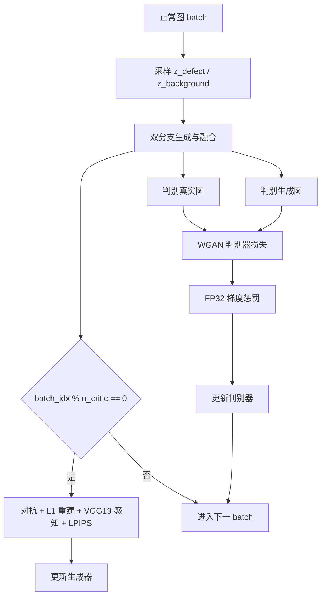
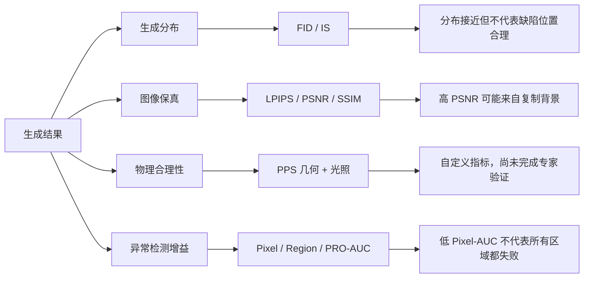

# 项目可视化与可解释性指南

本页集中展示 Focus-StyleGAN 的模型结构、增广决策、训练循环、评估逻辑和失败诊断。所有图均为 Mermaid 文本，不使用位图架构图。

## 图 1：项目能力思维导图

## 图 2：双分支生成与判别流

图 2 的关键解释：缺陷分支和背景分支没有共享最终输出，而是先各自形成表示，再由融合模块学习局部异常与全局结构之间的权重。

## 图 3：增广策略决策树

这张决策树说明四类增广不是竞争关系，而是依赖条件和业务目标不同的可切换方案。

## 图 4：训练循环与损失流

重要解释：

- 判别器每个 batch 更新。
- 生成器由 `batch_idx % n_critic == 0` 触发，默认在索引 0、5、10……更新。
- 梯度惩罚使用 FP32，对抗主体可以使用 AMP。

## 图 5：指标解释与问题归因

## 视觉阅读顺序

1. 图 1 看项目全貌。
2. 图 2 看双分支生成器和判别器如何连接。
3. 图 3 看不同数据条件下选择哪种增广。
4. 图 4 看 WGAN-GP 和辅助损失的实际训练顺序。
5. 图 5 看不同指标各能解释什么、不能解释什么。